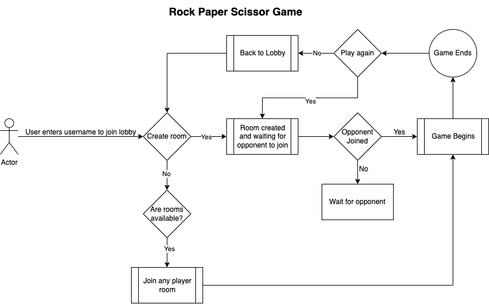

# Rock, Paper, Scissors

## Table of contents

- [Rock, Paper, Scissors](#rock-paper-scissors)
  - [Table of contents](#table-of-contents)
  - [Overview](#overview)
  - [Built with](#built-with)

## Overview

Users should be able to:

- View the optimal layout for the game depending on their device's screen size
- Play Rock, Paper, Scissors against each other in the same browser but with different tabs
- **Bonus**: Play Rock, Paper, Scissors, Lizard, Spock against the computer _(optional)_

Game includes a: 
- Leaderboard to display user rankings
- Waiting List to keep track of new players when 2 players are already engaged in a game.

### Built with

- Semantic HTML5 markup
- CSS custom properties
- Flexbox
- CSS Grid
- Mobile-first workflow
- [React](https://reactjs.org/) - JS library
- [Styled Components](https://styled-components.com/) - For styles
- [Typescript](https://react-typescript-cheatsheet.netlify.app/) - For type definitions
- [Redux Toolkit](https://redux-toolkit.js.org/) - For global state management
- [Socket.IO](https://socket.io/docs/v4/) - For establishing a low-latency, full-duplex communication channel between a client and a server

